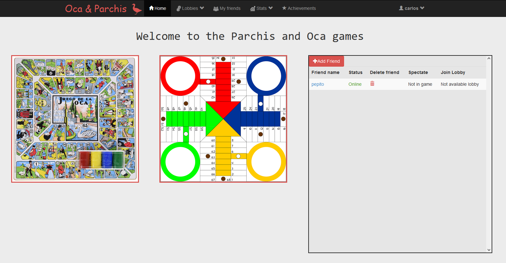
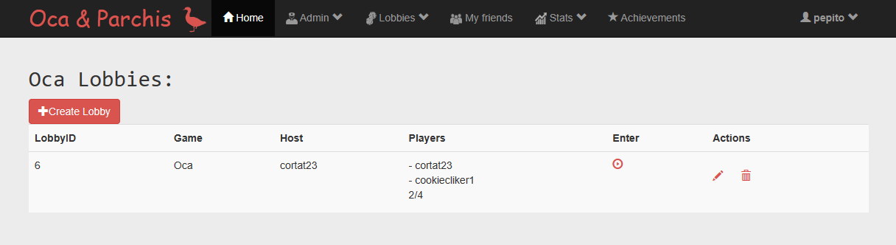
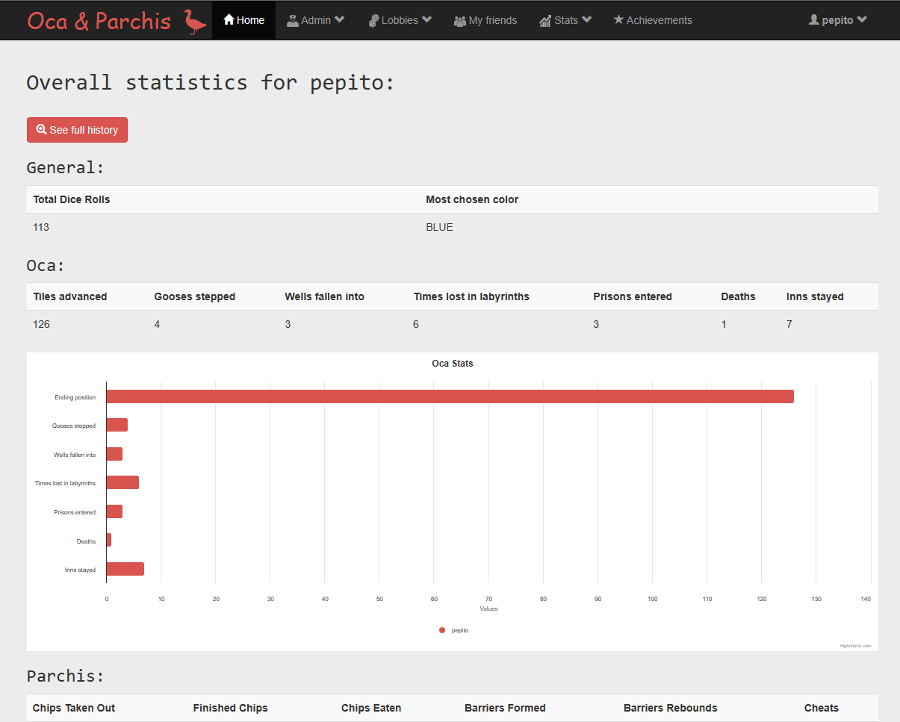
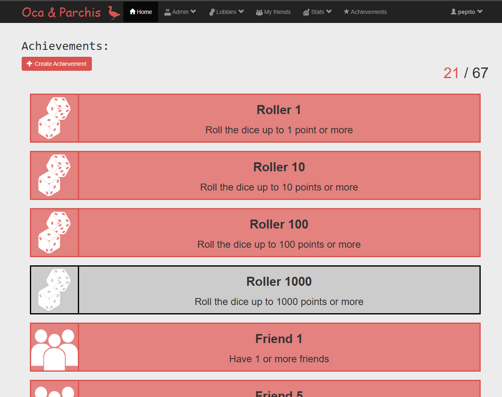

  

# Parchis Oca Games

Parchis Oca Games is a web application made with Java and Spring Boot that allows users to play the classic board games Oca and Parchis online with their friends or random opponents. It is a group project made for the subject Diseño y Pruebas I taking into account MVC design pattern.

## Table of Contents

- [Features](#features)
- [Getting Started](#getting-started)
- [Usage](#usage)
- [Tech Stack](#tech-stack)
- [Screenshots](#screenshots)
  
## Features

- Play Oca and Parchis games online with friends or random opponents.
- Connect with friends, send and receive friend requests, and see their online status. Easily invite them to join your game rooms for a fun-filled gaming experience. You can also spectate the games your friends are playing.
- Real-time gameplay.
- User authentication and registration.
- Admin role with CRUD permissions.
- Lobby system for creating and joining game rooms.
- Game chat for players to communicate during gameplay.
- Leaderboards to track player rankings.
- Personal and global statistics.
- Unlock various achievements as you play, based on your gameplay and accomplishments.
- Implementation of tests for all the features.

## Getting Started

### Prerequisites

Before running the project, make sure you have the following installed:

- Java Development Kit (JDK) 8 or higher
- Maven

### Installation

1. Clone the repository to your local machine:
   
   `git clone https://github.com/your-username/oca-parchis-online.git`

3. Run the application:
   
   `mvn spring-boot:run`
   
## Usage

1. Open your web browser and navigate to http://localhost:8080.
2. If you're a new user, click on "Register" to create an account. Otherwise, click "Login" to sign in.
3. Once logged in, choose a game to play! You'll be redirected to the lobby selector where you can create a new game room or join an existing one.
4. Connect with your friends on using the "My friends" feature. Send and receive friend requests, and check your friends' online status.
5. Join friends' game room using the "My friends" list or wait for other players to join.
6. Start playing Oca and Parchis with your friends!

## Tech Stack

Here is a brief high-level overview of the tech stack this project uses:

- **[Java](https://www.java.com/es/)**: Object-oriented programing language and computing platform.

- **[Spring Boot](https://spring.io/projects/spring-boot)**: Framework for building Java-based, production-ready applications with ease, providing various tools and libraries for application development.

- **[Maven](https://maven.apache.org/)**: Build automation and project management tool used for managing dependencies and building Java projects. 

- **[H2 SQL Database](https://www.h2database.com/html/main.html)**: In-memory and disk-based relational database management system.

- **[Lombok](https://projectlombok.org/)**:  Java library that simplifies code by automatically generating boilerplate code, such as getters, setters, and constructors.

- **[Tomcat](https://tomcat.apache.org/)**: Runtime environment for JavaServer Pages in web applications.

- **[Bootstrap](https://getbootstrap.com/)**: A front-end framework for creating responsive and visually appealing web interfaces.

- **[JUnit](https://junit.org/junit5/)**: Testing framework for Java that facilitates unit testing by providing tools for writing and running test cases.
  
- **[Mockito](https://site.mockito.org/)**: Java library for creating mock objects, enabling easier testing by simulating the behavior of real objects in a controlled manner.
  
## Screenshots

